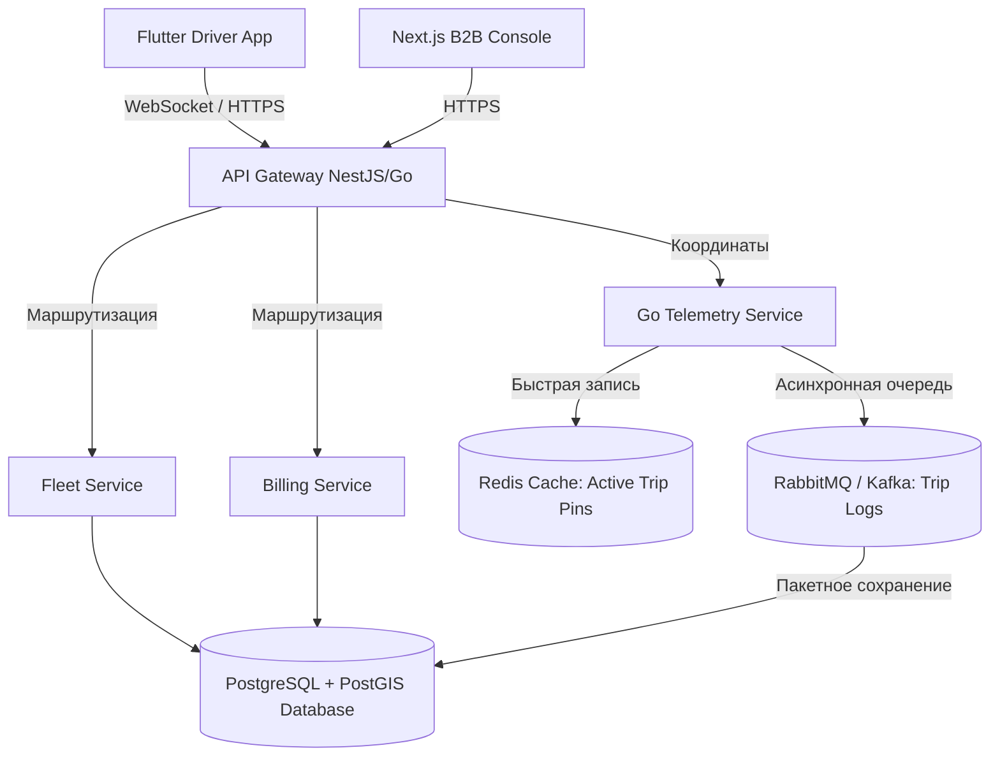

# ТЗ и план MVP: B2B-каршеринг платформа (Узбекистан)

> Рабочее допущение (озвучиваю сразу, чтобы ТЗ было конкретным): под "B2B каршерингом" понимается платформа, где **компания-клиент** подключает свой автопарк (или пул арендованных у оператора авто) и даёт своим сотрудникам возможность бронировать и брать машины по корпоративным правилам, с прозрачным биллингом и отчётностью для бухгалтерии/AXO. Если у вас другая модель (например, платформа сама владеет парком и сдаёт его юрлицам как подписку) — большая часть ТЗ не поменяется, скорректируется только блок тарификации.

---

## 📌 Текущий прогресс MVP (Интерактивный чек-лист)

Ниже представлен актуальный статус реализации функционала MVP согласно требованиям:

### ✅ Реализовано в рамках MVP (Фронтенд Next.js + Мобильное приложение Flutter)

* **2.1 Онбординг компании и KYB:**
  * `[x]` B2B Посадочная страница (Landing Page) с презентацией платформы и выбором тарифов.
  * `[x]` Интерактивная B2B форма заявки с автозаполнением выбранного тарифа («Выделенный парк», «Общий пул», «Корпорация»).
  * `[x]` Загрузка устава/документов (симуляция в форме регистрации).
* **2.2 Управление сотрудниками (Corporate Admin):**
  * `[x]` Приглашение сотрудников и мгновенная выписка лимитов (модальное окно с выбором бюджета).
  * `[x]` Модерация прав сотрудников и управление активными статусами.
* **2.3 Управление автопарком (Fleet Manager):**
  * `[x]` Карточка авто и интерактивная карта Ташкента с пинами машин.
  * `[x]` Контроль ТО (отправка на сервис и возврат одной кнопкой).
  * `[x]` **Детализация телеметрии**: клик на автомобиль открывает панель с живой скоростью, зарядом, давлением в шинах, температурой двигателя и локальной картой.
  * `[x]` Добавление автомобиля в парк через модальное окно.
* **2.4 Бронирование и доступ (Flutter Driver App):**
  * `[x]` Полноценное мобильное приложение на **Flutter** (папка `mobile`) с SMS-авторизацией.
  * `[x]` Интерактивная векторная карта Ташкента на Canvas с возможностью выбора авто кликом по пинам.
  * `[x]` Чек-лист осмотра кузова, чистоты салона и шин перед стартом аренды.
  * `[x]` **Интерактивная поездка**: динамический счетчик времени аренды и стоимости в UZS (изменяется в реальном времени каждую секунду).
  * `[x]` Удаленные команды (открытие дверей, гудок) со снекбарами и финальный чек.
  * `[x]` **Фотоосмотр кузова до/после поездки**: 4-сторонний фотоконтроль (Спереди, Сзади, Слева, Справа) с симулятором камеры перед началом и после окончания поездки.
  * `[x]` **Диагностика топливо/заряд**: бензиновые авто (Cobalt, Nexia, Spark) показывают «Топливо» с иконкой бензоколонки; электромобили (BYD Song Plus EV) — «Заряд» с иконкой молнии.
  * `[x]` **4 диагностических блока**: Топливо/Заряд, КПП, Салон, Климат — соответствие мокапу лендинга.
  * `[x]` **Корпоративный тариф баннер**: зелёная плашка «Списание с корпоративного счёта ООО» в карточке автомобиля.
* **2.6 Тарификация и биллинг:**
  * `[x]` Настройка бюджетов сотрудников, отслеживание баланса компании.
  * `[x]` Кнопка «Пополнить баланс» через Click/Payme/Счет-фактуру с обновлением депозита.
  * `[x]` **Экспорт отчетов**: кнопка выгрузки текущих транзакций лимитов в CSV-формат.
* **2.7 Штрафы и инциденты:**
  * `[x]` Импорт штрафов ГУБДД и функция их **оплаты напрямую с корпоративного депозита** компании.
* **2.9 Уведомления и алерты:**
  * `[x]` Выпадающий список уведомлений (клик по колокольчику), отметка прочтения.
  * `[x]` Предупреждающий баннер при низком балансе депозита компании.
  * `[x]` Фоновое push-уведомление об исчерпании лимита отдела «Разработка» на 95%.
* **2.10 Локализация:**
  * `[x]` Локализация валют в сум (UZS) и языковой переключатель (RU/UZ/EN).

### ⏳ Осталось реализовать для Production релиза

* `[ ]` **Реальное GPS/OBD API**: замена симуляции телеметрии авто на интеграцию с физическими GPS-трекерами.
* `[ ]` **Интеграция шлюзов оплаты**: подключение боевых вебхуков и API от Click Business и Payme Business.
* `[x]` **Чат поддержки (Support Chat)**: виджет чата с оператором для водителей в приложении и админке.
* `[x]` **Двухфакторная авторизация (2FA)**: подтверждение входа в B2B-консоль для администратора компании.

---

## 1. Роли пользователей

| Роль | Кто это | Платформа |
|---|---|---|
| **Super Admin** | владелец сервиса каршеринга | Web |
| **Corporate Admin** | HR/АХО/офис-менеджер компании-клиента | Web |
| **Fleet Manager / Dispatcher** | управляет состоянием авто, ТО, штрафами | Web |
| **Driver (сотрудник)** | бронирует и водит машину | iOS + Android |
| **Support** | обработка обращений | Web |

---

## 2. Функциональные модули MVP

### 2.1 Онбординг компании и KYB
- Регистрация юрлица (ИНН/СТИР, реквизиты, устав/доверенность)
- Верификация вручную (Super Admin подтверждает) — для MVP без автоматической интеграции с гос. реестрами
- Загрузка договора оферты, подписание (для MVP — загрузка скана, DocuSign/аналог — уже пост-MVP)
- Настройка лимитов: сколько сотрудников, сколько авто, тарифный план

### 2.2 Управление сотрудниками (Corporate Admin)
- Приглашение сотрудников (по номеру телефона/email)
- Роли внутри компании: обычный сотрудник / ограниченный доступ (только рабочие часы, только определённые авто)
- Загрузка и проверка водительских прав сотрудника (фото + вручную модерация)
- Деактивация/блокировка сотрудника

### 2.3 Управление автопарком (Fleet Manager)
- Карточка авто: марка, модель, гос.номер, VIN, год, статус (свободен/забронирован/в поездке/на ТО/в ремонте)
- Геолокация авто в реальном времени (если ставится GPS/ОБД-трекер)
- График ТО и пробег, напоминания о плановом обслуживании
- Учёт топлива/заряда (для электромобилей — % заряда)
- Прикрепление авто к конкретной компании или в общий пул

### 2.4 Бронирование (Driver app)
- Карта: доступные авто рядом / по расписанию
- Фильтр по типу кузова, коробке, наличию детского кресла и т.п.
- Бронирование на конкретный слот времени или "прямо сейчас"
- Правила компании: рабочие часы, лимит км, разрешённая зона (гео-забор по городу/области)
- Отмена/перенос брони

### 2.5 Доступ к авто и поездка
Для MVP реалистичный вариант без дорогого "железа":
- **Вариант А (дешевле для MVP):** ключ выдаёт диспетчер/есть ключевой сейф (лок-бокс) у авто, код в приложении открывает бокс
- **Вариант Б:** интеграция с OBD/GPS-трекером с поддержкой дистанционной разблокировки (дороже, но ближе к "настоящему" каршерингу)
- Старт поездки: чек-лист осмотра авто (фото повреждений, уровень топлива) прямо в приложении
- Трекинг поездки: маршрут, пробег, время
- Завершение поездки: повторный чек-лист, фото, автоматический расчёт стоимости/списание с лимита компании

### 2.6 Тарификация и биллинг (B2B specific)
- Тарифные планы на уровне компании (подписка/пакет км/почасовая)
- Автоматическое агрегирование расходов по сотруднику/отделу
- Формирование ежемесячного акта/счёта для компании (выгрузка в PDF/Excel)
- Интеграция с локальными платёжными системами: **Payme, Click, Uzcard/Humo**
- Лимиты и алерты (компания может ограничить бюджет на сотрудника/месяц)

### 2.7 Штрафы и инциденты
- Занесение штрафа ГУБДД к конкретной поездке/сотруднику
- Фиксация ДТП: фото, описание, статус разбирательства
- История по авто (все инциденты)

### 2.8 Отчётность и аналитика
- Corporate Admin: расходы по отделам/сотрудникам, использование парка, простой авто
- Super Admin: доходность по компаниям, загрузка парка, churn

### 2.9 Уведомления и поддержка
- Push/SMS: подтверждение брони, начало/окончание аренды, напоминание о ТО, штраф
- Чат поддержки или тикет-система (для MVP достаточно простого чата с оператором)

### 2.10 Локализация и юридическое
- Языки: **узбекский (латиница), русский, английский**
- Соответствие Закону РУз "О персональных данных" — **хранение персональных данных граждан Узбекистана должно быть на серверах, физически расположенных в Узбекистане** (это важно для выбора хостинга — см. раздел 5)
- Учитывать лицензионные требования к перевозкам/аренде авто в РУз (стоит свериться с юристом отдельно — этот момент вне компетенции ТЗ)

---

## 3. Нефункциональные требования

- Доступность 99.5%+ (для MVP не нужен overkill, но архитектура должна позволять расти)
- Хранение персональных данных — локальный ЦОД/облако с серверами в Узбекистане (например, локальные дата-центры, а не просто AWS eu-west)
- Поддержка слабого интернета (3G) — оптимизация трафика в мобильных приложениях
- Двухфакторная авторизация для Corporate Admin
- Логирование всех действий с авто (audit trail) — важно для споров по ДТП/штрафам

---

## 4. Технологический стек (рекомендация)

| Слой | Технология | Почему |
|---|---|---|
| Backend | **Node.js (NestJS)** или **Go** | NestJS — быстрее нанять/найти разработчиков в СНГ, Go — производительнее для геолокационных нагрузок |
| БД | **PostgreSQL** + PostGIS | геоданные (зоны, местоположение авто) |
| Кэш/очереди | **Redis**, **RabbitMQ/Kafka** | real-time статусы авто, уведомления |
| Web (admin + corporate dashboard) | **React + Next.js**, TypeScript | быстрая разработка, много готовых компонентов |
| Мобильные приложения | **Flutter** | один код на iOS и Android — критично для скорости и бюджета MVP |
| Карты | **Google Maps SDK** (или Yandex MapKit как fallback в регионе) | наиболее стабильны в Узбекистане |
| Push | **Firebase Cloud Messaging** | |
| Платежи | **Payme Business API**, **Click API** | локальные платёжные провайдеры |
| Хостинг | локальный провайдер (например, дата-центр внутри РУз) или гибрид | требование к персональным данным |
| DevOps | Docker, GitHub Actions/GitLab CI, Sentry, Grafana | |

**Почему Flutter, а не нативная разработка (Swift + Kotlin отдельно):** для MVP это экономит примерно 40-50% времени и бюджета, потому что один разработчик/команда пишет один код для iOS и Android одновременно. Нативная разработка (2 отдельные команды) имеет смысл только после MVP, если понадобится глубокая работа с Bluetooth-ключами/железом для разблокировки авто — тогда возможен гибридный подход: Flutter + нативные плагины под конкретное железо.

---

## 5. Необходимые роли и скиллы в команде

| Роль | Кол-во для MVP | Ключевые скиллы |
|---|---|---|
| Product Manager / Product Owner | 1 | приоритизация фич, работа с ТЗ, локальный B2B-рынок |
| UI/UX-дизайнер | 1 | Figma, дизайн-система, mobile-first |
| Backend-разработчик | 1-2 | Node.js/NestJS или Go, PostgreSQL, REST/GraphQL, интеграции с Payme/Click |
| Frontend (web)-разработчик | 1 | React, Next.js, TypeScript |
| Mobile-разработчик | 1-2 | Flutter, Dart, работа с картами и геолокацией, push |
| QA-инженер | 1 (можно part-time) | ручное + автотесты ключевых сценариев |
| DevOps | 1 (part-time/аутсорс) | Docker, CI/CD, локальный хостинг |
| Юрист/бизнес-аналитик | консультационно | законодательство РУз по персональным данным и аренде авто |

Для настоящего MVP (не полноценного продукта) реалистичная команда — **5-7 человек** на 3-4 месяца.

---

## 6. Дорожная карта MVP (примерно 14-16 недель)

1. **Недели 1-2 — Discovery и дизайн**: уточнение бизнес-модели, юр. проверка, прототип в Figma, финальный список MVP-фич
2. **Недели 3-6 — Backend core + Web admin/corporate dashboard**: пользователи, компании, авто, бронирование
3. **Недели 5-9 — Мобильное приложение (Flutter)**: параллельно с backend — бронирование, чек-лист поездки, push
4. **Недели 8-10 — Интеграция платежей и биллинг**: Payme/Click, формирование счетов
5. **Недели 10-12 — Тестирование**: внутреннее QA + пилот с 1-2 реальными компаниями
6. **Недели 13-14 — Доработки по фидбэку пилота**
7. **Неделя 15-16 — Запуск**

---

## 7. Дизайн

Ниже прикреплю интерактивный мокап с ключевыми экранами: мобильное приложение водителя (бронирование, чек-лист, активная поездка) и веб-дашборд корпоративного администратора. Это черновой визуальный концепт — реальный дизайн стоит доработать в Figma с UI/UX-дизайнером перед разработкой.

---

## 8. Риски, на которые стоит обратить внимание отдельно (не входят в ТЗ, но важны)

- **Юридический статус каршеринга/аренды в РУз** — уточнить у юриста, нужна ли лицензия
- **Требование локального хранения персональных данных** — влияет на выбор хостинга и бюджет
- **"Железо" для разблокировки авто** — либо закладывать бюджет на GPS/OBD-трекеры и лок-боксы, либо начинать с ручной передачи ключей через диспетчера на MVP-этапе
- **Страхование** — кто несёт ответственность при ДТП корпоративного авто, нужно продумать до запуска

---

## 9. Архитектура и структура папок для масштабирования (Scalability Structure)

Для обеспечения роста платформы с MVP до полноценной распределенной системы обслуживания тысяч поездок и сотен корпоративных автопарков, предлагается следующая архитектура.

### 9.1 Единый монорепозиторий YOʻLDA (Unified Workspace)

Вся кодовая база платформы (веб-интерфейсы, бэкенд-сервисы и мобильный клиент) размещается в едином репозитории в одной общей папке. Это упрощает совместную разработку, сквозное тестирование и CI/CD:

📂 yolda-platform-monorepo
├── 📂 backend (Бэкенд-сервисы на NestJS / Go)
│   ├── 📂 apps/
│   │   ├── 📂 api-gateway/ — единая точка входа, лимитирование, JWT
│   │   ├── 📂 telemetry-service/ — сервис на Go для сбора координат авто
│   │   ├── 📂 billing-service/ — расчет тарифов, акты, платежи Click/Payme
│   │   ├── 📂 fleet-service/ — управление статусами машин, ремонты и ТО
│   │   └── 📂 auth-service/ — авторизация и KYB проверка юридических лиц
│   └── 📂 libs/
│       ├── 📂 database/ — схемы таблиц PostgreSQL и PostGIS сущности
│       └── 📂 common/ — общие хелперы, логи и валидаторы
├── 📂 frontend (Сайт и консоль управления на Next.js)
│   ├── 📂 app/ — Next.js App Router (сайт, консоль администратора)
│   ├── 📂 components/ — интерфейсы (dashboard, landing, mobile-app)
│   └── 📂 public/ — статические изображения, логотипы, карта Ташкента
└── 📂 mobile (Мобильное приложение водителя на Flutter)
    ├── 📂 lib/
    │   ├── 📂 core/ — сетевые клиенты, роутинг, кэш сессии
    │   └── 📂 features/ — экраны бронирования, активной поездки и чек-листов
    └── 📄 pubspec.yaml — зависимости и пакеты Flutter

### 9.2 Архитектурная схема потока данных

### 9.3 Ключевые решения для масштабирования

1. **Мультиарендность (Multi-tenancy):**
   - На уровне БД используется колонка `company_id` с индексацией (Shared Database, Separate Schemas) для изоляции доступа сотрудников одной компании к автомобилям другой компании.
2. **Обработка телеметрии (IoT Telemetry Pipeline):**
   - Вместо записи каждого GPS-сигнала напрямую в PostgreSQL (что создает высокую дисковую нагрузку), координаты пишутся в высокопроизводительный буфер **Redis** (для отображения текущей точки авто на карте диспетчера). 
   - Поездка логируется в очередь **RabbitMQ**, откуда фоновый воркер раз в 15-30 секунд сохраняет координаты пакетом в БД.
3. **Гео-запросы (PostGIS):**
   - Зоны использования каршеринга (гео-заборы) хранятся как полигоны в PostGIS. Быстрая проверка "находится ли водитель в разрешенной зоне" выполняется с помощью R-Tree пространственных индексов.
4. **Масштабирование БД:**
   - Чтение исторических отчетов/биллинга перенаправляется на Read-Replica БД, а основные операции записи (старт/стоп аренды) — на Master инстанс.

